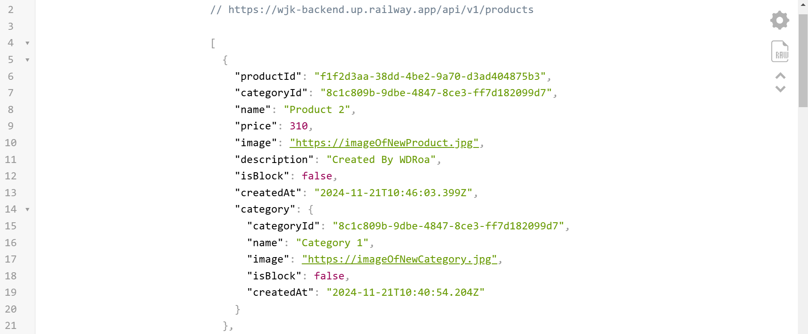

    
     (BACKEND)

    < --Preview-- >  
     

Hello! 🙂 I am **Willie David Roa (WDRoa)** 😎, and I welcome you to the **WJK backend codebase**. 😊 A project initially created to be modeled in my professional portfolio along with its frontend (WJK), 😉 in order to help me get my first job as a software developer. 🙈

Although this project has a lot to improve, I do not want to deny that I have the illusion that later on, I will use it to be the backend real  of one of my companies. 🙈 When that time comes and I decide to work on this project with more colleagues, I will take care 👌🏼of adding the corresponding features to this file. Such as:

- *Necessary information to quickly understand how the project works and contribute to it effectively. This includes installation instructions, configuration, dependencies, how to run the project and maintain it, how to run tests, technologies used, etc.*

- *A contribution manual and a code of conduct.* 🙃

All of this is to provide clarity and direction to anyone who has access to this repository. 👌🏼

Without further ado… **I wish you 🙏🏼 an excellent read and a quick understanding!** 😊
